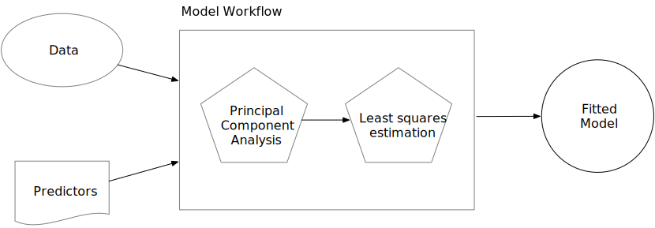

```{r setup, message=FALSE, warning=FALSE, include=FALSE}
knitr::opts_chunk$set(message = FALSE,warning = FALSE)

library(tidyverse)
library(tidymodels)
library(corrplot)
library(Amelia)

data <- read_csv('./data/mortgage/mortgage_sample_50k.csv')
```

In this guided practice we will address how to preprocess data for a machine learning modeling in `tidymodels`. We will work with the **Home Mortgage Disclosure Act Data, NY, 2015** provided and compiled by the [Consumer Finance Protection Board](https://www.kaggle.com/datasets/jboysen/ny-home-mortgage?resource=download). This dataset covers all mortgage decisions made in 2015 for the state of New York.

```{r}
head(data)
```

As you can see, this dataset contains various information regarding the people who applied for loans and the neighborhoods in which they live: demographic and socio-economical. We have some categorical variables, such as: 

```{r}
data %>% select_if(is.character) %>% names()
```

But also numerical features: 

```{r}
data %>% select_if(is.numeric) %>% names()
```

The first way in which we can get an overview of our data is using the `skim()` function from the package `skimr`.

```{r}
skimr::skim(data)
```

This returns different tibbles with an overview of the minimum, maximum, number of NA's and unique values for each of the rows. This might be a lot of information at first, but we can see an overview of the summary values of the dataset. In general, we can distinguish:

-   Missing values in the columns of family units, occupied units, family income, population values and MSAMD income.
-   Outliers in the columns of loan amounts, number of family units, population, MSAMD income and family income. The categorical values are not interpretable, since they appear as character values and we are not able to see a count of the categories. The first step we should do here is **transform** the type of variable from character to factor. Factor variables are used to work with categorical variables that have a fixed and known set of possible values.

```{r}
data <- data %>% mutate_if(is.character, ~as.factor(.))
```

Now, let's look at the summary of those variables.

```{r}
skimr::skim(data %>% select(action_taken_name:purchaser_type_name))
```

Now, we can see the count of categories for each variable and the appearance of NA's. The variables that contain NA are county_name and msamd_name. The function `summary` also sums up categories with a relative low frequency into the group `(Other)`, as in the case of purchaser_type_name.

We could explore this by each variable:

```{r}
skimr::skim(data$hud_median_family_income)
```

# Missing values

An useful package to analyze presence of missing values within a dataset is `Amelia`. The function `missmap` allows us to get an overview of the missing values within a dataset for each column and observation.

```{r}
missmap(data)
```

In the theory, we addressed that NA's could be handled by being deleted or imputated. Deletion of NA's is the easiest solution, since we have different ways to address it. Tidyverse contains the function `drop_na()`, that removes rows where any column specified contains a missing value. If we don't specify anything, it removes rows that contain a missing value across *any* column.

```{r}
removing_all_na <- data %>% drop_na()

missmap(removing_all_na)
```

To specify a column, we just have to write it down between the parenthesis.

```{r}
removing_na_population <- data %>% drop_na(population)

missmap(removing_na_population)
```

We can select multiple columns separating them by commas.

```{r}
removing_na_pop_minority <- data %>% drop_na(minority_population, population)

missmap(removing_na_pop_minority)
```

Other times, we might be interested in removing variables where most of the rows have NA. If the sample is not big enough, it won't make sense to impute values.

```{r}
data %>%
  summarise(across(everything(), ~ sum(is.na(.)))) %>%
  unlist %>% 
  sort(decreasing = T)
```

# Imputation of values

Now, recall that removing rows that contain missing values in the dataframe carries the problem of removing potential information from other features that could be relevant to our model. This is why we can also use imputation of values, replacing the missing values with an existing one, keeping the row as information for the model. The package `Amelia` contains functions to perform multiple imputation regression on the dataset. This falls outside the scope of this class, since we will address manual imputations with tidyverse, but the documentation to explore that kind of imputation [is available here](https://cran.r-project.org/web/packages/Amelia/vignettes/using-amelia.html).

We will address how to perform imputation of variables with `tidyverse`. We will use as an example the variable `hud_median_family_income`, which contains 180 missing values. The distribution of this variable looks as follows:

```{r}
ggplot(data, aes(x = hud_median_family_income))+
  geom_density()
```

The distribution of values shows sparsity with no discernible central tendency or normal distribution. A noteworthy observation is the concentration around an income level of \$70,000 USD. In the context of imputation, the objective is to substitute missing values with those making the minimal influence on the variable's distribution. This is why we can employ the median. We can use the `mutate` and `if_else` functions from the `tidyverse` to replace NA values with the column's median value.

```{r}
replace_na_mean_income <- data %>% 
  mutate(hud_median_family_income = if_else(is.na(hud_median_family_income),
                                            median(hud_median_family_income, na.rm = T),
                                            hud_median_family_income))

ggplot(replace_na_mean_income, aes(x = hud_median_family_income))+
  geom_density()
```

We can see that this returns the same distribution for the variable that we had before! Note that this is the case when we have a low number of missing values and a large data set. In data sets with many missing values, this might introduce more bias, but in this case it seems like a good solution. We can impute the median to all numerical values:

```{r}
data <- data %>% mutate_if(is.numeric, ~if_else(is.na(.), median(., na.rm = T), .))

missmap(data)
```

Now, we have the remaining problem of the NA's in categorical values. Following the same logic we had for numerical values, we can impute the mode for the variables with NA in factor columns using the function `mlv` from the package `modeest`.

```{r}
data <- data %>%
  mutate_if(is.factor, ~if_else(is.na(.), modeest::mlv(.), .))
```

This has the same result as the imputation with the median. 

## Outliers

One way of detecting outliers is by looking at the maximum and minimum values printed out in the `skimr::skim()` descriptive statistics. However, this is not the only way to discover outliers in a dataframe. Drawing a boxplot is also useful to detect these values. Recall that these graphs help visualize a quantitative variable by displaying five common location summary (minimum, median, first and third quartiles and maximum) and any observation that was classified as a suspected outlier. A boxplot identifies these values by defining an upper and lower bound for potential outliers:

-   Lower Bound: Q1 (first quartile) - 1.5 \* IQR (interquartile range)
-   Upper Bound: Q3 (third quartile) + 1.5 \* IQR (interquartile range)

Any data point below the lower bound or above the upper bound is considered an outlier. These values are identified as individual points outside the whiskers of the boxplot. For example, look at this boxplot of the median family income:

```{r}
ggplot(data, aes(y = hud_median_family_income))+
  geom_boxplot()
```

There is a clear outlier of a family that has a median income of \$110,000 USD. We could replace that value manually, first calculating the lower and upper bound.

```{r}
Q1 <- quantile(data$hud_median_family_income, na.rm = T)[2]
Q3 <- quantile(data$hud_median_family_income, na.rm = T)[4]

IQR <- IQR(data$hud_median_family_income, na.rm = T)

lower_bound <- Q1 - 1.5*IQR
upper_bound <- Q3 + 1.5*IQR

```

And then replacing the values in the data that match the criteria.

```{r}
data <- data %>% 
  mutate(hud_median_family_income = if_else(
    hud_median_family_income < lower_bound | hud_median_family_income > upper_bound,
    median(hud_median_family_income, na.rm = T),
    hud_median_family_income))

skimr::skim(data$hud_median_family_income)
```

This completely changes the distribution of the variable, so it's important to remember that these decisions produce an important bias on our dataset.

### Tidymodels

The package to work with machine learning modeling in R is called `tidymodels`. It exists as part of the `tidyverse`, but has to be installed separately. It works with *workflows*, objects that can bundle together pre-processing, modeling, and post-processing requests [@silgea].

The concept of workflows introduces a shift in perspective, directing our attention towards a holistic *modeling process* rather than solely fixating on tailoring a specific model for parameter estimation. In essence, this entails viewing modeling not merely as the determination of function parameters and their alignment with our data but as a comprehensive sequence involving preprocessing, parameter estimation, fitting, post-processing, and iterative refinement. The optimal model won't be achieved in the initial training. In further classes, we will see that achieving an ideal model involves evaluating its performance with diverse parameters and undergoing multiple training iterations. Consequently, binding together the analytical components of data modeling is important for the accurate estimation of the ideal model.

[{width="649"}](https://www.tmwr.org/workflows)

We can use `tidymodels` workflows with the function `workflow()`.

In the practical sense, these objects allow us to adjust and make predictions with a simple `fit()` and `predict()` call, in a single object that already has saved the entire preprocessing. We define the preprocessing of the data with the function `recipe()`. Unlike the formula method inside a modeling function, the recipe defines the steps via `step_*()` functions without immediately executing them; it is only a specification of what should be done. It is important to note that recipes can be used as preprocessing for the modeling, but also for the cleaning and transformation of the data.

A basic recipe that predicts the mortgage status looks like:

```{r}
mortgage_rec <- recipe(action_taken_name ~ ., data = data)

mortgage_rec
```

It has two arguments:

-   A **formula**. Any variable on the left-hand side of the tilde (`~`) is considered the model outcome (here, `action_taken_name`). On the right-hand side of the tilde are the predictors. Variables may be listed by name, or we can use the dot (`.`) to indicate all other variables as predictors.

-   The **data**. A recipe is associated with the dataset used to create the model. This will typically be the *training* set, so `data = data` here.

Here, our variables are classified into only two roles [@manually]: predictors and an outcome. However, our data contains the variable `respondent_id`, which is not actually a predictor. Recipes can label and retain column(s) of the data set that should not be treated as outcomes or predictors.

```{r}
mortgage_rec <- mortgage_rec %>% 
  update_role(respondent_id, new_role = "ID") 

mortgage_rec
```

Note that we can update the steps of the preprocessing directly on the recipe object using pipes.

We can use tidymodels recipes to perform imputations on NA. For example, we can use the function `step_impute_mode()` to impute the mode on NA's for categorical variables.

```{r}
mortgage_rec <- mortgage_rec %>% 
  update_role(respondent_id, new_role = "ID") %>%
  step_impute_mode(msamd_name) %>%
  prep()

tidy(mortgage_rec, number = 1)
```

The function `tidy()` summarizes information about the model's components. In this case, it shows us the mode which was used to impute values in the variable msamd_name. [Here](https://recipes.tidymodels.org/reference/index.html#step-functions-imputation) is a full list of all the steps available for imputation.

# Dealing with highly correlated variables

Recall that we addressed multicolinearity of variables as an issue because it might overfit the data, or reduce the model's robustness. To explore multicolinearity, we can use the function `cor()` from R base.

```{r}
correlation_of_variables <- data %>% select_if(is.numeric) %>% cor()

correlation_of_variables
```

But, to make the result more interpretable, we can use the package `corrplot()` to display this information in a plot.

```{r}
corrplot(correlation_of_variables)
```

The variable number_of_owner_occupied_units exhibits a strong correlation with number_of_1_to_4_family_units and population. This correlation is intuitive, as areas with higher populations tend to have more residences across all categories. To address multicollinearity in our dataset, employing techniques like feature selection or Principal Component Analysis (PCA) is advisable.

For feature selection, the `step_cor()` function from tidymodels proves convenient. By specifying a threshold with the threshold parameter, we can efficiently eliminate variables with high absolute correlations.

```{r}
corr_mortgage <- mortgage_rec %>% 
  step_corr(all_numeric_predictors(), 
            threshold = 0.5,
            id = 'remove variables with large correlation')

tidy(corr_mortgage, number = 1)
```

Note that this doesn't actually update the data. Steps in a workflow aren't executed automatically. Recipes in Tidy Modeling are like recipes in real life: they just describe the steps we will perform on our ingredients, but it is not the execution of the cooking itself. Following this culinary analogy, the functions used to apply the recipe to the dataset are `prep()` and `bake()`. `prep()` fits the preprocessing to our defined dataset, it tunes the parameters of the modeling to our variables and features. In this scenario, it computes the correlation of the variables to define which ones will be removed according to the threshold. `bake()` actually applies the recipe to the dataset and returns a new, preproccessed dataset.

```{r}
baked_corr <- corr_mortgage %>% 
  prep() %>%
  bake(new_data = data)

colnames(baked_corr)
```

It's important to recognize that after feature selection, the dataset contains `r ncol(baked_corr)` variables instead of the original `r ncol(data)`, reflecting the removal of variables like `number_of_owner_occupied_units.`

Now, how would we do this with PCA? Recall that PCA is an unsupervised modeling method that reduces the dimensionality of a set of features by producing components that are the linear combination of those features. We could input the variables correlated and generate two principal components that explain the variability of our data and reduce multicolinearity.

```{r}
step_pca_estimates <- mortgage_rec %>% 
  step_pca(
    number_of_owner_occupied_units, number_of_1_to_4_family_units, population, 
    num_comp = 2,
    options = list(rank. = 2)
  ) %>% 
  prep()


tidy(step_pca_estimates, number = 2)

```

Here, `prep()` shows us the coefficients for our components. The first component shows negative values of population and number of units. But the second component appears to explain large populations and low values of available units. This could be potentially relevant information for our modeling.

# Transformation of variables

In our class notes, another topic covered was the transformation of existing variables. This transformation typically involves recoding variables and normalizing them.

For categorical variables, two valuable transformations supported by recipes involve creating dummy variables and grouping observations with minimal occurrences into an 'Other' category.

Grouping observations into categories with a higher number of observations proves as useful to eliminate noise from models. This noise often arises from input data lacking significant information, potentially causing overfitting and compromising model robustness. To address this, we can employ the `step_other()` function, which aggregates less frequently occurring values into an "other" category. By specifying the `threshold` parameter as an integer, we establish a criterion based on the proportion of observations within a category. Any level falling below this threshold gets grouped into the "other" category.

```{r}
other_rec <- mortgage_rec %>%
  step_other(msamd_name, co_applicant_race_name_1,
             threshold = 0.10,
            id = 'recode other variables') %>%
  prep()

tidy(other_rec, number = 1)
```

Another method involves recoding variables through the creation of dummy variables. In scenarios where models only accept quantitative inputs, transforming categorical values into numerical ones is essential. This transformation results in new variables, each representing a category from the original column. These variables adopt a binary format, indicating the presence (1) or absence (0) of a specific category. This process enables us to represent categorical information in a numerical format compatible with models that necessitate numerical input.

With `recipes()`, we can achieve this using the function `step_dummy()`:

```{r}
dummy_mortgage <- mortgage_rec %>%
  step_dummy(agency_name:purchaser_type_name,
            id = 'create dummy variables')

baked_dummy <- dummy_mortgage %>% 
  prep() %>%
  bake(new_data = data)

baked_dummy %>% 
  select(starts_with('applicant_race_name'))
```

Note that this generates 6 new columns, reflecting the encoding of the values of the original variable into these.

For quantitative variables, common types of preprocessing are centering, scaling or normalization of variables. These methods are related to adjusting the distribution of variables so they can be comparable and used for machine learning models.

**Centering** involves shifting the values of a variable so that the mean becomes zero. The goal is to remove any inherent bias or offset in the data. It is done by substracting the average of a variable from all the observations in said variable. It can be done with the function `step_center()`.

```{r}
center_rec <- mortgage_rec %>%
  step_center(all_numeric_predictors(),
            id = 'center predictors') %>%
  prep()

tidy(center_rec, number = 2)
```

Note that in this output, the function `tidy()` shows us the mean value for each variable after centering them.

**Scaling** a variable implies normalizing the data to have a standard deviation of one. It can be done with `step_scale()`. The function scales numerical variables to a specified range or *standardizes* them to have a mean of zero and a standard deviation of one.

```{r}
scale_rec <- mortgage_rec %>%
  step_scale(all_numeric_predictors()) %>%
  prep()

tidy(scale_rec, number = 2)
```

Finally, we can **normalize** scales of the values of a variable to a standard scale, usually with a mean of 0 and a standard deviation of 1. It is the operation of scaling and centering a variable, with the goal of bringing all variables to a similar scale, facilitating comparisons. It can be done with the function `step_normalize()`.

```{r}
normalize_rec <- mortgage_rec %>%
  step_normalize(all_numeric_predictors(),
            id = 'normalize predictors') %>%
  prep()

tidy(normalize_rec, number = 2)

```

In summary, when it comes to handling statistical models in R with a tidy methodology, the go-to framework is `tidymodels`. This approach encapsulates the entire modeling workflow, encompassing preprocessing, modeling, and subsequent post-processing stages. While basic tidyverse functions like `mutate`, `filter`, `drop_na`, and plotting tools can execute some preprocessing tasks, leveraging recipes within `tidymodels` [offers a wide range of `step_` functions explicitly created for data preparation in modeling contexts.](https://recipes.tidymodels.org/reference/index.html) These specialized functions enhance data preprocessing, ensuring it aligns effectively with the goal of building robust models. This is the comprehensive workflow that `tidymodels` enables, seamlessly integrating various stages to create effective and reliable statistical models. These steps might seem abstract at first, but will make more sense in future lectures dedicated to modeling.

