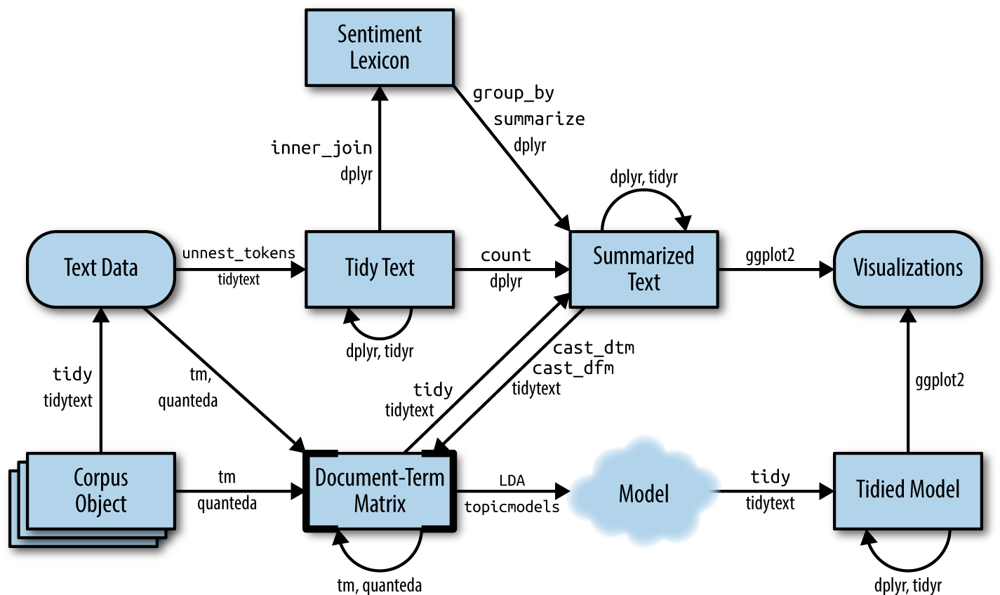

In this guided practice we will learn how to train a LDA model in R using the State of the Union discourses.  

```{r setup, message=FALSE, warning=FALSE, include=FALSE}
knitr::opts_chunk$set(message = FALSE,warning = FALSE)
```

Loading libraries and data
```{r}
library(tidyverse)
library(tidytext)
library(topicmodels)
library(textclean)
library(janitor)
library(stm)

data <- read_csv('data/state_ofthe_union_texts.csv')
```


cleaning data
```{r}

data <- data %>% 
  clean_names() # column names normalization

data <- data %>%
  filter(year >= 1934) # filter discourses from 1934

data <- data %>% 
  mutate(id = row_number()) %>% #add row id
  select(id, everything())

# some text cleaning
data <- data %>% 
  mutate(text = str_replace_all(text, "[:digit:]", ""),
         text = str_replace_all(text, "´", "'"),
         text = replace_contraction(text),
         text = str_replace_all(text, "[\\[\\]]", ""),
         text = str_replace_all(text, "'", ""),
         text = str_replace_all(text, "\"", ""))
```

# Preprocessing
We will train LDA using unigrams: this means that we only consider single tokens as words

```{r}
token_unigrams <- data %>%
  select(id, president, year, text) %>% 
  unnest_tokens(word, text)

token_unigrams %>%
  group_by(id) %>%
  summarise(n=n())
```
Notice that `unnest_tokens` took care of several preprocessing stages:

- Other columns, such as the line number each word came from, are retained.
- Punctuation has been stripped.
- By default, `unnest_tokens()` converts the tokens to lowercase, which makes them easier to compare or combine with other datasets. (You can use the `to_lower = FALSE` argument to turn off this behavior).

We can now eliminate stop-words (and we can add some custom stop-words):

```{r}
stop_words_data <- stop_words
stop_words_data <- stop_words_data %>% 
  add_row(word = c('united', 'states', 'u. s.', 'u.s', 
                   'program', 'programs',
                   'government', 'congress', 
                   'applause', 'tonight', 'nation', 'nations', 'national',
                   'administration',
                   'country', 'americans',
                   'public', 'people', 'america', 'american', 'world'))

token_unigrams <- token_unigrams %>%
  anti_join(stop_words_data)
```

We generate the word count table.
```{r}
word_count <- token_unigrams %>%
  group_by(id, president, year, word) %>%
  summarise(n = n()) %>%
  ungroup()

word_count
```

## creating the document-term-matrics
Our data frame word_counts is in a tidy form, with one-term-per-document-per-row. We need to transform it to a `DocumentTermMatrix`, the format required by `topicmodels` package. We can cast a one-token-per-row table into a `DocumentTermMatrix` with `tidytext`’s `cast_dtm()`.

```{r}
dtm <- word_count %>% cast_dtm(id, word, n)
```

## Train LDA
We can use the `LDA()` function from the topicmodels package, setting $k = 4$, to create a fairly simple four-topic LDA model.

```{r}
tictoc::tic()
lda <- LDA(dtm, k = 4, control = list(seed = 753))
tictoc::toc()
```

This was the easy part. The main problem will be to explore and interpret the model using tidying functions from the `tidytext` package.

## Word-topic probabilities

The tidytext package offers a method to extract per-topic-per-word probabilities from the model, referred to as $\beta$ ("beta").
```{r}
word2topics <- tidy(lda, matrix = "beta")
word2topics
```

The output of applying `tidy()` to the LDA object is a table in one-topic-per-term-per-row format. For each combination, the model computes the probability of that term being generated from that topic. For example, the term “abolished” has an almost zero probability of being generated from topics 4 or 5, but it increases to 0.000030 for topic 1.

Let's find the most frequent terms for each topic and make a nice plot out of those:
```{r}
top_terms <- word2topics %>%
  group_by(topic) %>%
  slice_max(beta, n = 10) %>% 
  ungroup() %>%
  arrange(topic, -beta)

top_terms %>%
  mutate(term = reorder_within(term, beta, topic)) %>%
  ggplot(aes(beta, term, fill = factor(topic))) +
  geom_col(show.legend = FALSE) +
  facet_wrap(~ topic, scales = "free") +
  scale_y_reordered() +
  theme_minimal()
```

This visualization allows us to understand the topics extracted from the articles. 

- Topic 1, the most prevalent words include "war", "federal", "peace" and "economic", meaning that it relates to armed conflicts and their expenses.
- Topic 2 is characterized by "time", "jobs", "children", and "care". So this is a topic related with the economics discussion about the job market, health and taxes.
- Topic 3 aproached war from a different perspective, with focus on freedom and security. 
- Finally, topic 4 focuses on economy but mixing terms also related with war. 

Some words means seems to have similar or related meaning are present in both topics: "war", "future", "time". This shows an advantage of topic modeling over "hard clustering" methods: topics in natural language often exhibit some overlap in terms of words.


## Document-topic probabilities
LDA also allows us to model documents as a mixture of topics. We can analyze the document-topic probabilities matrix using `tidy()` and setting `matrix="gamma"`.

```{r}
doc2topics <- tidy(lda, matrix="gamma")
doc2topics %>%
  mutate(document=as.numeric(document)) %>%
  arrange(document, topic, desc(gamma))
```
The model estimates that document 1 is almost all on topic 1, while document 1 has a bit of a mix.

- It worth noting that maybe the probabilities alone are not the best to choose the most distinctive terms per topic, because
common words will have a higher probability across topic. 
- **Relevance** [@sievert_2014] is an interesting metric that combines probability with distinctiveness 

## Structural Topic Modeling (STM)

The last technique we are going to review in this guided practice is STM. As we mentioned above, its main use is to allow the introduction of covariates in topic modeling and to enable topics (either their prevalence or content) to vary based on external variables or metadata.

The usage is similar to the previous case. We just need to transform the tibble `word_count` into another object, a `dfm`:
```{r}
dfm <- word_count %>%
  cast_dfm(id, word, n)

head(dfm)
```

Then, we can generate a tibble with the metadata we are going to use later:
```{r}
metadata <- token_unigrams %>%
  select(id, president, year) %>%
  distinct() %>%
  left_join(data %>% select(id, text))
```

And then, we call the `stm` function. We are going to use the year of the speech as a variable that affects the prevalence.
```{r}
stm_4 <- stm(documents = dfm,
             K = 4,
             prevalence = ~year,
             max.em.its = 75, 
             data = metadata,
             init.type = "Spectral")
```

If we wanted to vary the content, we would just need to pass the parameter content with the covariate:
```
content = ~year
```

We generate the same two basic matrices as in LDA:
```{r}
betas_stm <- tidy(stm_4, matrix='beta')
doc_2_topics_stm <- tidy(stm_4, matrix='theta')
```

And we can plot the results:
```{r}
betas_stm %>%
  group_by(topic) %>%
  slice_max(beta, n = 15) %>% 
  ungroup() %>%
  arrange(topic, -beta) %>%
  mutate(term = reorder_within(term, beta, topic)) %>%
  ggplot(aes(beta, term, fill = factor(topic))) +
  geom_col(show.legend = FALSE) +
  facet_wrap(~ topic, scales='free_y') +
  scale_y_reordered() +
  theme_minimal()
```

### Some useful tools in STM

Now, once we have estimated our STM topic model, it is extremely important to proceed with its validation. Let's see that the stm package has implemented some functions that make this validation task quite easy.

Let's explore two possible ways to proceed with model validation. The first one is to analyze the words that are part of each topic. This is similar to what we have been doing so far, but with a difference: until now, we had been working with the words that have the highest β, that is, the highest probability of belonging to each topic. STM allows us to obtain other lists of words. Let's call the following function:
```{r}
labelTopics(stm_4)
```

This output shows four lists of words. Let's focus on the first two:

- __Highest prob__: These are the words within each topic with the highest probability (directly inferred from the topic-word distribution parameter β). These are the ones we used in the plots above.

- __FREX__: This is a metric that attempts to combine frequency (β) with exclusivity. In other words, words with high FREX are distinctive words for topics: they are both frequent and exclusive. This is calculated by taking the harmonic mean of the rank by probability within the topic (frequency, i.e., the parameter β), and exclusivity is a measure that tries to quantify the relative use of a term in a topic compared to its use in other topics.

Thus, the distribution of words according to FREX in topic 4 shows that some contractions survived without expansion ("let's," "we've," etc.). However, "iraqis" is a relevant term.

To examine documents that are highly associated with topics, the findThoughts() function can be used. This function will print out the documents highly associated with each topic. Reading these documents is useful for understanding the content of a topic and interpreting its definition.

To make them easier to read, let's limit them to a few characters of each document.
```{r}
findThoughts(stm_4, 
             texts= metadata %>% mutate(text = str_sub(text, 200, 600)) %>% select(text) %>% pull(), 
             n=10, 
             topics=4)
```

It is observed that several of the texts do indeed refer to the invasion of Iraq and other conflicts.

## Workflow scheme
Here is a nice worfklow made by [@silge_2017] that will help you to understand the different operations and functions of `tidytext` and its interactions with other libraries (like `ggplot` or `dplyr`)  

