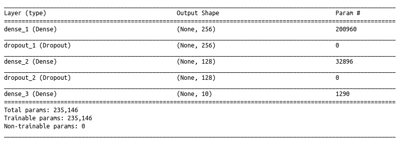
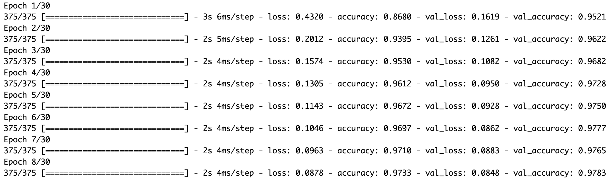

# Fully connected neural networks (FCNN)

In this guided practice we will build a fully connected neural network (FCNN) to predict handwritten digits.

-   We will use the [keras](https://tensorflow.rstudio.com/guides/keras/basics) library.
-   This library was originally developed in Python, as most of the deep learning community uses this language. It is a high-level implementation of [Tensorflow](https://github.com/tensorflow/tensorflow).
-   The R version of keras (and tensorflow) is simply calling their Python versions in the background. This is why in order to install them we need to have Python in our computers. This dialog between Python and R is made through the package `reticulate`.

```{r setup, message=FALSE, warning=FALSE, include=FALSE}
knitr::opts_chunk$set(message = FALSE,warning = FALSE)
```

We first need to load the needed libraries.

```{r}
# devtools::install_github("rstudio/keras")
# install_keras()
library(keras) # Remember to check the setup file for proper installation!!
library(tidyverse)
library(knitr)
```

## MNIST

Our dataset has 60,000 images, of 28x28 pixels, representing handwritten numbers.

```{r message=FALSE, warning=FALSE}
mnist <- dataset_mnist()

x_train <- mnist$train$x
y_train <- mnist$train$y
x_test <- mnist$test$x
y_test <- mnist$test$y
```

Each value represents a gray-scale pixel (from 0 to 255). The higher the value, the darker the pixel.

The data is in a 3-dimensional array (image, width, length). As we have 60K images, this has the form of:

```{r}
dim(x_train)
```

> *What is the extra dimension with value 1?\
> This is a dimension commonly reserved in images for the three channels of Red Green and Blue (RGB) that compose color images. As this image is just black and white, it only has one channel. Complex image data, like satellite images, can actually have more than 3 channels.*

### Input

The first thing to do is to *re-shape* and *re-scale* the data:

-   FCNN can only receive vectors as input (as other machine learning models). So we need to flatten the image into a single vector.

```{r}
# reshape
x_train <- array_reshape(x_train, c(nrow(x_train), 28*28)) 
# the first dimension is as long as the number of observations,
# the second dimension is the flattened matrix (28*28)

x_test <- array_reshape(x_test, c(nrow(x_test), 28*28))
```

-   We also need to convert the scale of the data from integers between 0 and 255 to floating point numbers between 0 and 1.

```{r}
# rescale
x_train <- x_train / 255
x_test <- x_test / 255
```

### **Output**

```{r}
y_train %>% head(.)
```

It is a vector of integers between 0-9.

-   Given the implementation of networks, we need to transform it to *one-hot encoding*. This means that instead of having the 10 possible values in a single column, we will have 10 columns, where each one represents a category.

-   This is done with the `to_categorical()` function of Keras

```{r}
y_train <- to_categorical(y_train, 10)
y_test <- to_categorical(y_test, 10)
```

What does this look like?

```{r}
y_train %>% head(.)
```

## Model definition

To build the model we first define the type of model. For that we use `keras_model_sequential()` which allows us to simply stack layers of the network.

```{r warning=FALSE}
model <- keras_model_sequential() 
```

-   In the first layer we have to clarify the `input_shape`. In this case it is one-dimensional (we just flattened it), but it could be a tensor of any dimension (!!). The size of the input is 28\*28 = 784.
-   Layers are added with pipes `%>%`.
-   The last layer needs to have the same number of units as our output categories. Because we use a `softmax` activation function, the output of the model is a *vector that assigns a probability to each of the categories*.
-   In each layer we have to define an activation function. For the internal layers we can try `relu`.
-   We also add dropout with `layer_dropout(x)` between layers.

```{r}
model %>% 
  layer_dense(units = 256, activation = 'relu', input_shape = c(784)) %>% 
  layer_dropout(rate = 0.4) %>% 
  layer_dense(units = 128, activation = 'relu') %>%
  layer_dropout(rate = 0.3) %>%
  layer_dense(units = 10, activation = 'softmax')
```

If we call the `model` we get a summary of layers, their shapes and number of parameters.

```{r echo=T, results='hide',eval=F}
model
```



Let's see why we have so many trainable parameters:

-   The first layer receives an input of size 784, and it has 256 nodes, as it is fully connected, there are weights between every input and every node, `784*256`, and also each node has a bias.

```{r}
784*256+256
```

-   The `dropout` layer is a regularization and does not adjust any parameters.

-   `dense_2` layer connects the 256 nodes of the first layer with its 128 nodes:

```{r}
128*256+128
```

-   And the third layer connects the 128 nodes with its 10 nodes:

```{r}
128*10+10
```

### **Compilation**

We need to *compile the model* indicating the `loss` function, what type of `optimizer` to use, and what `metrics` we care about.

```{r}
model %>% compile(
  loss = 'categorical_crossentropy',
  optimizer = optimizer_rmsprop(),
  metrics = c('accuracy')
)
```

## Training

To fit the model we use the `fit()` function, which requires the following parameters:

-   The array with the training data `x_train`,
-   The array with the outputs `y_train`,
-   `epochs`: How many times will it traverse the training dataset,
-   `batch_size`: how many observations it will look at in each iteration of the backpropagation,
-   `validation_split`: We split the data at each epoch in train and validation to evaluate the metrics.

```{r echo=T, results='hide',eval=F}
fit_history <- model %>% fit(
  x_train, y_train, 
  epochs = 30, batch_size = 128, 
  validation_split = 0.2
)
```

This last code-chunk takes time to run, so there is no need to do it now. But it would return something like:



`fit_history` can be saved as an .RDS file. In our case, we already did that previously...

```{r include=FALSE, eval=F}
# save the history
saveRDS(fit_history,"results/fc_hist.RDS")
```

... and we can load that same file to keep working without re-running the fitting step.

```{r include=FALSE, eval=T}
# load the history. No need to show this code. You can run the pre-run history
fit_history <- read_rds("results/fc_hist.RDS")
```

The `fit()` returns an object that includes the loss and accuracy metrics.

```{r}
fit_history
```

We can plot this object with `plot()` and it returns an *ggplot* object that we can modify

```{r}
plot(fit_history)+
  theme_minimal()+
  labs(title= "Evolution of the Loss and Accuracy in train and validation")
```

> *Notice that the trained model, with which we can predict, is still called `model`.*

**It is important to save the model after training, in order to reuse it**. For that we use a special file format called '.h5'.

```{r eval=FALSE, echo=T}
model %>% save_model_hdf5("results/fc_model.h5")
```

And we can load a pre-trained model like this:

```{r}
pretrained_model <- load_model_hdf5("results/fc_model.h5")
```

```{r}
pretrained_model
```

## Evaluation

If we want to *evaluate the model on the test set* we can use the `evaluate()` function.

```{r}
pretrained_model %>% evaluate(x_test, y_test)
```

If we want to get the predicted category over the data, we need to:

1.  Use the `predict` function from keras. This will give us the probability for each digit.
2.  The `k_argmax` function selects the digit with the highest probability.
3.  As keras in R actually uses Python in the background, we will have to use the `reticulate` package to make some operations:
4.  Change the type of data from a tensorflow element to a numpy element.
5.  Move the data from Python to R.

```{r}
pretrained_model %>% 
  predict(x_test) %>% 
  k_argmax()  %>% 
  reticulate::np_array() %>% 
  reticulate::py_to_r() %>% 
  head()
```
