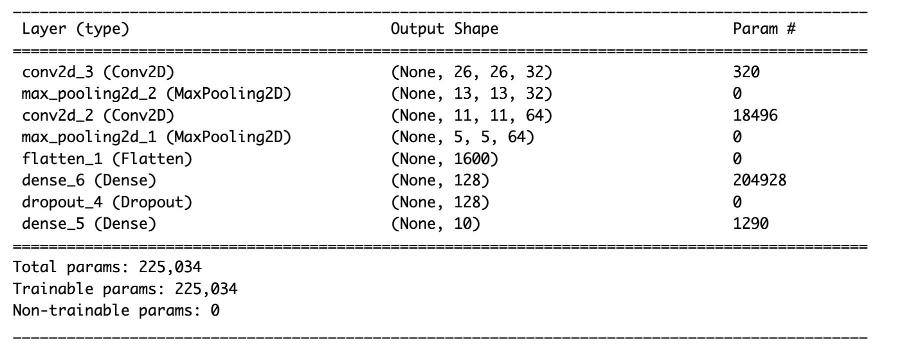
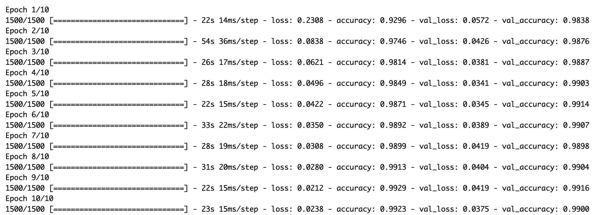

```{r setup, message=FALSE, warning=FALSE, include=FALSE}
knitr::opts_chunk$set(message = FALSE,warning = FALSE)
```

# Convolutional neural networks

```{r}
# devtools::install_github("rstudio/keras")
# install_keras()
library(keras)
library(tidyverse)
library(knitr)
```

## MNIST

1.  Load MNIST data and create the following datasets:

-   x_train
-   y_train
-   x_test
-   y_test

```{r}

```

2.  Show the dimensions of the `x_train` data and explain each of them.

```{r}

```

### Dimensions of the task

3.  Assign values for the following variables:

-   `num_classes`: Number of classes

-   `img_rows`: Image height in pixels

-   `img_cols`: Image width in pixels

```{r}

```

### Input

We need to reshape the `x_train` and `x_test` to fit the structure that a CNN needs, which are:

-   Number of observations
-   Image height
-   Image width
-   The **color** dimension: Normally with RGB colors this dimension has three color channels. In our case, given that the data is black and white, we need to put 1.

4.  Use the function to reshape x_train and x_test, and define a vector called `input_shape`

> Hint: The code should look similar to\
> `array_reshape(x, c(nrow(x), img_rows, img_cols, 1))`

```{r}

```

5.  Re-scale the values for `x_train` and `x_test` from the 0-255 scale to a 0-1 scale.

```{r}

```

### **Output**

6.  Use the function `to_categorical()` to convert the outputs to one-hot encoding, using the variable `num_classes` previously defined.

```{r}

```

## Model definition

7.  Define a model with the following layers:

-   conv2d (filters = 32, kernel size = c(3,3), activation = relu)
-   max pooling (pool size = c(2, 2))
-   conv2d (filters = 64, kernel size = c(3,3), activation = relu)
-   max pooling (pool size = c(2, 2))
-   flatten
-   dense layer (units = 128, activation = 'relu')
-   dropout (rate = 0.5) 8 dense layer (units = num_classes, activation = 'softmax')

```{r}

```

8.  Run `model` to see the model summary

```{r}

```

If the model was correctly specified, you should get something similar to this:



9.  Explain the number of parameters of each layer

<!-- -->

10. Compile the model using *categorical cross-entropy* for the loss function, the *adam* optimizer and the *accuary* as performance metric.

```{r}

```

## Training

11. Train the model with the following parameters:

-   epochs = 10

-   batch size = 32

-   validation split = 0.2

and save the fit history to a variable called `fit_history`.

```{r}

```

The training should look something like: 

12. Plot the fit history.

```{r}

```

13. Save the model in a .h5 file

```{r eval=FALSE, echo=T}

```

14. Use the model to evaluate the accuracy on the test set

```{r}

```
